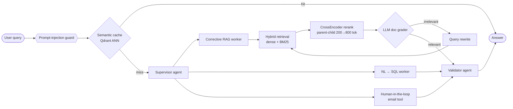

<!-- ═══════════════════════════════  HEADER  ═══════════════════════════════ -->
<div align="center">


<a href="https://www.linkedin.com/in/sahajs59/">
  
</a>

<br/>

<a href="https://sahajivvix-1.github.io/Portfolio2026/"></a>
<a href="https://www.linkedin.com/in/sahajs59/"></a>
<a href="https://x.com/SahajS59"></a>
<a href="https://sahajs59.medium.com"></a>
<a href="mailto:sahajs7959@gmail.com"></a>
<a href="https://raw.githubusercontent.com/SahajIVVIX-1/SahajIVVIX-1/main/Resume_WIcon.pdf"></a>


</div>

---

## 🧠 About Me

<div align="center">
<picture>
  <source media="(prefers-color-scheme: dark)" srcset="https://raw.githubusercontent.com/SahajIVVIX-1/SahajIVVIX-1/main/dark_mode.svg">
  
</picture>
</div>

```python
class SahajSaliya:
    role       = "AI Engineer & Researcher"
    education  = "B.Tech ICT @ PDEU, Gandhinagar  (CGPA 8.5 · graduating May 2027)"
    building   = ["Multi-agent LLM systems", "Self-correcting RAG", "RL-driven agents"]
    interests  = ["LLMs", "AI Agents", "RAG", "AI Infrastructure", "Cybersecurity", "Advanced ML"]
    philosophy = "Ship it, benchmark it, then make it smarter."

    def now(self):
        return "Turning research ideas into open-source tools engineers actually use."
```

---

## 💼 Experience

<table>
<tr>
<td width="50%" valign="top">

### 🛰️ Research & Innovation Intern
**HNNOIX Private Limited** · *May – Jul 2026*

- Built reusable AI infrastructure for **6G R&D** — **LLM Gateway**, **RAG Runtime**, **AI Memory Layer** & **Knowledge Base**
- Enabled scalable agent execution, context management and workflow orchestration
- Applied GenAI, RAG and agent-based decision-making to network architectures & communication systems

</td>
<td width="50%" valign="top">

### 📈 Freelance Financial AI Engineer
**Quantitative Investment Analysis** · *Dec 2024 – Jun 2025*

- Shipped **2 autonomous trading-signal systems** using Agentic AI + RAG over live market news
- **↓ 37% false-positive signals** via confidence scoring & filtering rules
- **CrewAI** research pipeline over GPT-4, Bloomberg, FMP & Alpha Vantage for automated earnings analysis

</td>
</tr>
</table>

---

## 🚀 Featured Projects

### 🏆 [Enterprise Agentic RAG Orchestrator](https://github.com/SahajIVVIX-1/Multi-Agent-RAG)
> *Production-grade multi-agent RAG with a self-correcting retrieval loop*

<p>


</p>



- **Supervisor → Worker → Validator** pipeline routing across Corrective RAG, NL-to-SQL and human-in-the-loop tools
- **CRAG loop** with LLM document grading + query rewriting; hybrid Qdrant dense + BM25 retrieval, CrossEncoder reranking
- Sub-millisecond **semantic caching**, Redis session memory, prompt-injection guards and Fernet encryption

<br/>

<table>
<tr>
<td width="50%" valign="top">

### 🤖 [OpenEnv — RL Data-Cleaning Agent](https://github.com/SahajIVVIX-1/open-env-nuclei)
*An agent that doesn't just clean data — it **learns** how to.*

- Custom **Q-Learning environment** where a **Llama 3** agent picks cleaning actions from structured observations
- Reward shaping, anti-loop penalties & step constraints against destructive ops
- Pydantic-typed JSON outputs, **FastAPI** server, **Docker** on HF Spaces

  
<a href="https://chetangadhiya017-data-cleaning-env.hf.space"></a>

</td>
<td width="50%" valign="top">

### 🧬 [Modern DCGAN Reproducibility Study](https://github.com/SahajIVVIX-1/Modern-DCGAN-Reproducibility)
*Re-implementing Radford et al. (2015) — then upgrading it.*

- Paper-faithful all-conv architecture modernised with **LSGAN** + **Spectral Normalization**
- Custom `GANAnalyzer` hooks internal layers to visualise learned filters & feature maps
- Formal **paper-vs-modern** comparison and 4-panel convergence dashboard

  

</td>
</tr>
<tr>
<td width="50%" valign="top">

### 📊 [Explainable Student-Performance Platform](https://github.com/SahajIVVIX-1/student-performance-platform)
*End-to-end MLOps with trustworthy explanations.*

- Benchmarks **9 ML/DL models** (XGBoost, CatBoost, LightGBM, PyTorch, FLAML) with Pandera validation
- **SHAP + LIME** attributions, Spearman rank correlation to measure explanation agreement
- MLflow tracking, FastAPI + Streamlit, Docker Compose, GitHub Actions CI

  

</td>
<td width="50%" valign="top">

### 🛡️ [SentinelProxy Suite](https://github.com/SahajIVVIX-1/SentinelProxy-Suite)
*Local HTTPS proxy + DNS server with a live threat dashboard.*

- HTTPS proxy and DNS resolver dropping malicious domains before a connection is negotiated
- Millions of blocklist domains in an indexed **SQLite3** store for near-zero-latency lookups
- Real-time **Socket.IO** dashboard, auto OS proxy/DNS hooks & firewall rules

  

</td>
</tr>
<tr>
<td colspan="2" valign="top">

### 🔬 [Microplastic Detection — SIH](https://github.com/SahajIVVIX-1/SIH-AI-Gyani)
**YOLOv11** (n/s/m/l) fine-tuned with custom hyperparameters for microplastic particle detection and size estimation under varying imaging conditions, built for Smart India Hackathon.
&nbsp;   

</td>
</tr>
</table>

<details>
<summary><b>🧰 Desktop & automation tools (Python · PyQt6)</b></summary>
<br/>

| Tool | What it does | Stack |
|---|---|---|
| 📺 [**vMix Manager**](https://github.com/SahajIVVIX-1/vMix-Manager) | Offline XML engine for batch-editing `.vmix` productions with GUID-safe cloning | `PyQt6` `XML` |
| 🚀 [**PyEnv Launcher**](https://github.com/SahajIVVIX-1/PyEnv-Launcher-Project) | Desktop control center for Python projects, environments and packages | `PyQt6` `venv` |
| 🔔 [**Smaran Reminder**](https://github.com/SahajIVVIX-1/Smaran-Reminder-App) | Non-intrusive tray reminders with deep scheduling and burst mode | `PyQt6` |
| 🎬 [**Video & PDF Suite**](https://github.com/SahajIVVIX-1/Video-Analyzer-Scroller) | FFmpeg folder auditing to Excel + PDF → 1080p scrolling-video generator | `OpenCV` `FFmpeg` |

</details>

---

## 🛠️ Tech Stack

<div align="center">

</div>
<br/>

| Domain | Tools |
|---|---|
| **🤖 GenAI & Agents** |        |
| **🧠 ML / DL / RL** |       |
| **🔎 Retrieval & Data** |       |
| **👁️ Vision & OCR** |     |
| **⚙️ MLOps & Infra** |       |

---

## 🏆 Achievements & Certifications

<table>
<tr>
<td width="50%" valign="top">

**🎖️ Achievements**
- 📜 **IEEE AIMV 2025** — presented 2 papers (Deepfake Detection, Crime Prediction)
- 🧪 **Code4Cause 2.0** — national-level finalist, NSUT Delhi
- 🌍 **ISRO-IIRS** — AI/ML for Geodata Analysis
- 📊 **IEEE Operations Lead** — coordinated paper presentations
- 💡 **GDG Gandhinagar** — AI & Firebase workshops

</td>
<td width="50%" valign="top">

**📜 Certifications**
- Agentic AI with LangChain & LangGraph — **IBM**
- Fundamentals of Building AI Agents — **IBM**
- Generative AI & AI Agents with Amazon Bedrock — **AWS**
- Deep Learning — **IIT Ropar (NPTEL)**
- Data Structures & Algorithms with Python — **Udemy**

</td>
</tr>
</table>

---

## 📊 GitHub Analytics

<div align="center">


<br/>

<br/><br/>

<br/>
<a href="https://leetcode.com/sahajs59"></a>
</div>

---

<div align="center">

### 💬 Open to AI Engineering & Research roles — let's build something intelligent together.

<a href="mailto:sahajs7959@gmail.com"></a>
<a href="https://www.linkedin.com/in/sahajs59/"></a>
<a href="https://sahajivvix-1.github.io/Portfolio2026/"></a>


</div>
