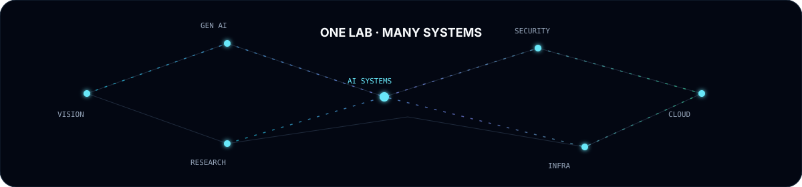
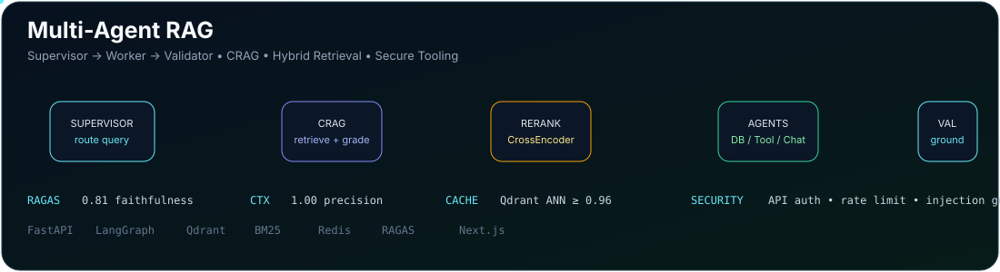

<div align="center">



[](https://sahajivvix-1.github.io/Portfolio2026/)
[](https://www.linkedin.com/in/sahajs59/)
[](https://github.com/SahajIVVIX-1)
[](https://x.com/SahajS59)

</div>


## `01` — THE LAB

I build **AI systems**, not isolated demos — systems where retrieval, reasoning, validation, security and infrastructure cooperate.

My current engineering orbit:

`AGENTIC AI` · `RAG` · `LLM SYSTEMS` · `COMPUTER VISION` · `ML` · `AI SECURITY` · `CLOUD`



> **Design principle:** make the model smarter by making the *system around the model* better.

---

## `02` — FLAGSHIP SYSTEM

### ⚡ Multi-Agent RAG / Enterprise Agentic RAG Orchestrator

<a href="https://github.com/SahajIVVIX-1/Multi-Agent-RAG">

</a>

This is the project I want people to understand first.

A production-oriented agentic RAG system with a **Supervisor → Worker → Validator** architecture. The implementation combines LangGraph orchestration, Corrective RAG, hybrid dense+sparse retrieval, CrossEncoder reranking, parent-child context expansion, Qdrant semantic caching, Redis-backed memory, guarded SQL/tool agents and human-in-the-loop actions. citeturn1view0

| System layer | What happens |
|---|---|
| **Gateway** | FastAPI boundary with authentication and rate limiting |
| **Supervisor** | Classifies the request and routes it to the right specialist |
| **CRAG** | Retrieves → grades → rewrites → retrieves again when needed |
| **Retrieval** | Qdrant dense search + BM25 sparse search + CrossEncoder reranking |
| **Context** | 200-token retrieval units expanded into 800-token parent context |
| **Agents** | Retriever · SQL/DB · Tool · Conversational |
| **Memory** | Redis sessions + queues; Qdrant ANN semantic cache |
| **Safety** | Prompt-injection guard, read-only SQL, API controls, encrypted secrets, HitL |
| **Validation** | Re-grounds the final response before returning `{answer, source, confidence}` |

### Evaluation snapshot

`0.81` **Faithfulness** &nbsp; · &nbsp; `1.00` **Context Precision** &nbsp; · &nbsp; `0.90` **Context Recall** &nbsp; · &nbsp; `0.75` **Answer Relevancy**

These figures are documented by the project from its evaluation datasets. citeturn1view0

**Stack:** `Python 3.11` · `FastAPI` · `LangGraph` · `LangChain` · `Qdrant` · `BM25` · `CrossEncoder` · `Redis` · `Next.js` · `TypeScript` · `RAGAS` · `pytest`

<div align="center">

**[ OPEN THE SYSTEM → ](https://github.com/SahajIVVIX-1/Multi-Agent-RAG)**

</div>

---

## `03` — OTHER SYSTEMS

### 🧠 Modern DCGAN Reproducibility
Generative modeling with training diagnostics, regularization, confidence analysis and latent-space inspection.

**PyTorch · Torchvision · GANs · Evaluation**  →  [repository](https://github.com/SahajIVVIX-1/Modern-DCGAN-Reproducibility)

### 🛡️ SentinelProxy Suite
Network gateway tooling combining HTTPS proxying, DNS resolution, traffic inspection, dynamic blocklists, RBAC and SQLite auditing.

**Node.js · Networking · Security · SQLite**  →  [repository](https://github.com/SahajIVVIX-1/SentinelProxy-Suite)

### 🤖 OpenEnv — RL Data Cleaning Agent
An autonomous data-cleaning environment where actions are optimized through reward-driven reinforcement learning.

**RL · Llama 3 · Docker · REST API**  →  [repository](https://github.com/SahajIVVIX-1/open-env-nuclei)

### 👁️ Computer Vision & Image Intelligence
Experiments and applications across detection, image processing, texture analysis and CUDA-backed inference.

**OpenCV · YOLO · PyTorch · CUDA**

---


## `04` — ENGINEERING STACK

<div align="center">

| Domain | Core tools |
|---|---|
| **Languages** | Python · C/C++ · JavaScript · SQL · MATLAB |
| **AI / ML** | PyTorch · TensorFlow · scikit-learn · XGBoost · GANs · RL |
| **LLM Systems** | LangGraph · LangChain · RAG · RAGAS · Transformers |
| **Retrieval** | Qdrant · BM25 · CrossEncoder · embeddings · reranking |
| **Backend** | FastAPI · Flask · Node.js · REST APIs · microservices |
| **Security** | API security · prompt-injection defenses · networking · secure tooling |
| **Data** | NumPy · Pandas · MongoDB · SQLite · Redis |
| **Cloud / Infra** | AWS · Docker · Linux · Git · CI/CD |
| **Vision** | OpenCV · YOLO · Pillow · CUDA |

</div>

---

## `05` — RESEARCH / BUILD LOG

```text
[AI SYSTEMS]       retrieval → reasoning → validation → action
[AGENTIC AI]       orchestration → tools → memory → safeguards
[SECURITY]         identity → boundaries → isolation → auditability
[COMPUTER VISION]  perception → representation → inference
[RESEARCH]         experiment → benchmark → reproduce → improve
```

The goal is not to collect frameworks. The goal is to understand the **architecture underneath them**.

---

## `06` — PROOF OF WORK

- 📜 IEEE conference presenter — AIMV 2025
- 🌍 ISRO-IIRS certified — AI/ML for Geodata Analysis
- 🧪 Code4Cause 2.0 — national-level finalist
- 📜 NPTEL — Deep Learning, IIT Ropar
- 💡 GDG Gandhinagar — AI/Firebase community work
- 📊 IEEE operations/research coordination

---

## `07` — GITHUB TELEMETRY

<div align="center">


</div>

<div align="center">

</div>

---

<div align="center">


### `BUILD → MEASURE → BREAK → LEARN → SHIP`

**AI systems • research • security • infrastructure**

[🌐 Portfolio](https://sahajivvix-1.github.io/Portfolio2026/) · [💼 LinkedIn](https://www.linkedin.com/in/sahajs59/) · [🐙 GitHub](https://github.com/SahajIVVIX-1) · [✉️ Email](mailto:sahajs7959@gmail.com)

</div>
